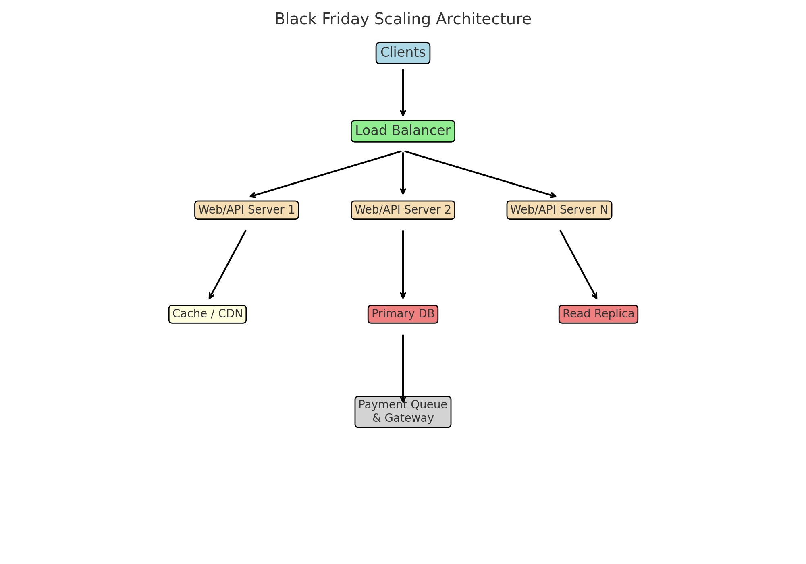

# 🗓️ Day 06: Scalability (Vertical vs Horizontal)

## I. Goal
Understand how to scale systems when user load grows, compare vertical and horizontal scaling, and practice applying scaling strategies.

## II. Core Concepts
- **Vertical Scaling (Scale Up)**: Add more CPU, RAM, Disk to a single machine.
- **Horizontal Scaling (Scale Out)**: Add more machines and distribute the load.
- **Load Balancer**: Distributes traffic among multiple servers.
- **Database Sharding**: Splitting data into smaller parts across servers.
- **Cache**: Reduce load on databases and speed up responses.

## III. Real-World Analogy
Vertical scaling = making a bus bigger.
Horizontal scaling = adding more buses to share passengers.

## IV. Pseudocode Practice
```python
class LoadBalancer:
    def __init__(self, servers):
        self.servers = servers
        self.index = 0

    def get_server(self):
        server = self.servers[self.index]
        self.index = (self.index + 1) % len(self.servers)
        return server
```

## V. Practice by Level
- **Level 1**: Explain the difference between vertical and horizontal scaling.
- **Level 2**: Design a scalable e-commerce system with caching + DB replication.
- **Level 3**: Add sharding and multiple data centers.

## VI. Exercise Design
**Scenario**: Black Friday Sale.
Traffic spikes 10x.
- How would you scale the web servers?
- How would you scale the database?
- Where would you put cache/CDN?

## VII. Quiz + Reflection
1. Why can’t vertical scaling alone handle FAANG-level traffic?
2. What is a “single point of failure” in scaling?
3. How do we prevent one DB shard from becoming a hotspot?

**Answers:**
1. Hardware has limits; no redundancy.
2. When one machine fails, everything fails.
3. Use good shard keys and consistent hashing.

## VIII. FAANG Interview Problem
**Design Instagram Feed Service**
- Handle 1B users.
- Discuss scaling reads/writes with caching, replication, sharding.


---

## 🖼️ Black Friday Scaling Diagram



This diagram shows:
- Clients → Load Balancer → Web/API servers
- Cache/CDN and Database replicas
- Payment queue and gateway for fault tolerance
