# DropBox Mini - System Architecture Diagrams

## 1. High-Level Architecture

## 2. File Upload Flow

```mermaid
sequenceDiagram
    actor User
    participant Client
    participant Auth
    participant Upload
    participant DB
    participant S3
    
    User->>Client: Select File
    Client->>Client: Calculate SHA-256 Hash
    Client->>Auth: Login Request
    Auth-->>Client: JWT Token
    
    Client->>Upload: POST /upload/init<br/>{file_name, file_size, file_hash}
    Upload->>DB: Check if hash exists (Dedup)
    
    alt File Exists (Deduplication)
        DB-->>Upload: File found
        Upload->>DB: Create metadata reference
        Upload-->>Client: {deduplication: true}
    else New File
        Upload->>DB: Create file & version record
        Upload-->>Client: {version_id, chunk_size, num_chunks}
        
        loop For each chunk
            Client->>Client: Split file into chunks
            Client->>Upload: POST /upload/chunk<br/>{version_id, chunk_index, chunk_data}
            Upload->>Upload: Verify chunk hash
            Upload->>S3: Upload chunk
            Upload->>DB: Save chunk metadata
            Upload-->>Client: {uploaded: true}
        end
        
        Client->>Upload: POST /upload/complete/{version_id}
        Upload->>DB: Verify all chunks uploaded
        Upload->>DB: Update user storage
        Upload-->>Client: {status: completed}
    end
    
    Client->>User: Upload Complete ✓
```

## 3. File Download Flow

## 4. File Sync Flow

```mermaid
sequenceDiagram
    actor User
    participant Watcher as File Watcher
    participant Sync
    participant Upload
    participant Download
    participant DB
    
    User->>Watcher: Start File Watcher
    Watcher->>Watcher: Monitor folder changes
    
    rect rgb(200, 255, 200)
        Note over Watcher,Upload: Local Change → Upload
        Watcher->>Watcher: Detect file created/modified
        Watcher->>Upload: Upload file (chunked)
        Upload->>DB: Save metadata
        Upload->>Sync: Notify change
    end
    
    rect rgb(200, 220, 255)
        Note over Watcher,Download: Remote Change → Download
        loop Every 30 seconds
            Watcher->>Sync: GET /sync/delta?since={timestamp}
            Sync->>DB: Get files changed since timestamp
            Sync-->>Watcher: {changes: [...]}
            
            alt Has Changes
                Watcher->>Download: Download changed files
                Download-->>Watcher: File data
                Watcher->>Watcher: Save to local folder
            end
        end
    end
    
    rect rgb(255, 230, 200)
        Note over Watcher,Sync: Real-time via WebSocket
        Watcher->>Sync: WS Connect /ws/sync/{user_id}
        Sync-->>Watcher: {type: file_change, data: {...}}
        Watcher->>Download: Download immediately
    end
```

## 5. Database Schema

## 6. Microservices Components

## 7. Data Flow - Chunking & Deduplication

## 8. Scalability & Performance

## 9. System Deployment

## Key Metrics & SLA

| Metric | Target | Current |
|--------|--------|---------|
| **Availability** | 99.9% | - |
| **Upload Speed** | 50 MB/s | - |
| **Download Speed** | 100 MB/s | - |
| **Sync Latency** | < 2s | - |
| **API Response Time** | < 100ms (p95) | - |
| **Storage Dedup Rate** | > 30% | - |

## Technology Stack Summary

---

**Diagrams created with Mermaid** - Render in GitHub, VS Code, or any Markdown viewer with Mermaid support 📊
